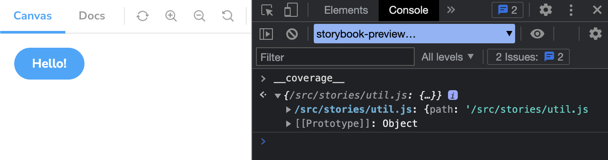

## What is code coverage?

Code coverage is a way to detect exactly what parts of your code are being tested. It's a concept offered by testing tools in the ecosystem for many programming languages like Java, Python, Javascript and more. In Javascript, [Jest](https://jestjs.io/) is a well known tool that provides such functionality.

When you can measure the coverage of your code, you can improve your code. Code coverage can give insights which can help surface uncovered test cases. This would allow developers to write more tests, so they can feel more confident about their code.

## What does code coverage have to do with Storybook?

If you think about it, whenever you write stories in Storybook, you are writing test cases. For example, you might have stories for a checkout form that show an empty state. With the help of interaction tests, you can test further scenarios such as a state with filled out fields, and another state with invalid fields. Storybook makes it so that just by developing components in it and writing stories, you end up writing test cases!

Even if you don't write interactions for your stories, just by rendering components in Storybook, you are already testing whether they render without crashing. You can then use the [**Storybook test runner**](https://storybook.js.org/docs/react/writing-tests/test-runner) to turn each of your stories into tests. On top of that, you can now use the test runner to generate code coverage reports!

## Storybook test runner

Storybook test runner turns all of your stories into executable tests. It is powered by Jest and Playwright.

For those without a play function: it verifies whether the story renders without any errors.
For those with a play function: it also checks for errors in the play function and that all assertions passed.

These tests run in a live browser and can be executed via the command line or your CI server.

The test runner can now be used to generate code coverage reports. However, it requires code to be instrumented.

## Instrumenting code?

The Storybook test runner does not have access to the lines of code, as it only visits a story from a running Storybook. In order to collect coverage information, there is a tool that instruments code called [Istanbul](https://istanbul.js.org/), and that coverage data is then stored in a way that is accessible by the test runner.

To understand how instrumentation works, let's pretend there is a function called `sayHello` that either says "Hello, ${name}!" or "Hello!", depending on how you call it.

```js
// util.js
function sayHello(name) {
  if (name) {
    return `Hello, ${name}!`;
  } else {
    return 'Hello!';
  }
}
```

When looking at the code, you can see that it consists of a function which contains conditional code statements (if, else). In order to fully cover this code, you would need to test both scenarios (with and without a name).

When we instrument the code, it will look a little different:

```js
// util.js

// the instrumenter of the code creates a variable to map "counts" for code coverage
const count = {
  // array of statements that count the time each of the statements are executed
  // because there are three statements, the array will have three elements
  s: [0, 0, 0],
  // counts the time conditional branches are executed (e.g. if else, switch case)
  b: [[0, 0]],
  // counts the time the functions are executed
  f: [0],
}

function sayHello(name) {
  // counts the time the function is executed
  count.f[0]++;
  // each "s" count precedes the lines of code (or statements) that are being executed
  count.s[0]++;
  if (name) {
    // first branch of this conditional statement is executed
    count.b[0][0]++;
    count.s[1]++;
    return `Hello, ${name}!`;
  } else {
    // second branch of this conditional statement is executed
    count.b[0][1]++;
    count.s[2]++;
    return 'Hello!';
  }
}
```

That code will then get executed once we visit stories in Storybook, and the counts will be stored in a `__coverage__` property in the window object:



With this object being available, the Storybook test runner can get the coverage coming form each story, and it will merge all of it and write into a file called `storybook-coverage.json`. This object is then used to generate the code coverage report.

This `sayHello` function was just for illustrative purposes. When getting coverage in a more realistic scenario, you can get a result like this:


## Try it yourself

To set up code coverage, you can do so in two steps.

### 1 - Instrument the code

To instrument your code, you can achieve that in two different ways: 

#### Using @storybook/addon-coverage

For select frameworks (React, Preact, HTML, Web components and Vue) you can use the [@storybook/addon-coverage](https://github.com/storybookjs/addon-coverage) addon, which will automatically add a istanbul babel plugin for you.

Install `@storybook/addon-coverage`:

```sh
yarn add -D @storybook/addon-coverage
```

And register it in your `.storybook/main.js` file:

```js
// .storybook/main.js
module.exports = {
  // ...rest of your code here
  addons: [
    "@storybook/addon-coverage",
  ]
};
```

The addon has default options that might suffice to your project, however if you want to customize the addon you can see how it's done [here](https://github.com/storybookjs/addon-coverage#configuring-the-addon).

#### Manually configuring istanbul

Some frameworks or Storybook builders might not automatically accept babel plugins. In that case, you will have to manually configure whatever flavor of [istanbul](https://istanbul.js.org/) (vite, webpack loader, etc.) your project might require. You can check the following repository containing [different recipes](https://github.com/yannbf/storybook-coverage-recipes) for different configurations.

### 2 - Run tests with --coverage flag

After setting up instrumentation, run Storybook then run the test-runner with `--coverage`:

```sh
yarn test-storybook --coverage
```

The test runner will report the results in the CLI and generate a `coverage/storybook/coverage-storybook.json` file which can be used by `nyc`.


If you want to generate reports with [different reporters](https://istanbul.js.org/docs/advanced/alternative-reporters/), you can use `nyc` and point it to the folder which contains the Storybook coverage file. `nyc` is a dependency of the test runner so you will already have it in your project.

Here's an example generating an `lcov` report:

```
npx nyc report --reporter=lcov -t coverage/storybook --report-dir coverage/storybook
```

This will generate a more detailed, interactive coverage summary that you can access at `coverage/storybook/index.html` file which can be explored and will show the coverage in detail:


Additionally, you can use tools like [Codecov](https://codecov.io/) to automate code coverage reporting, which will automatically detect the coverage files and can give you different ways to visualize coverage progress over time.

You can read more about code coverage in the test runner [documentation](https://github.com/storybookjs/test-runner#setting-up-code-coverage).